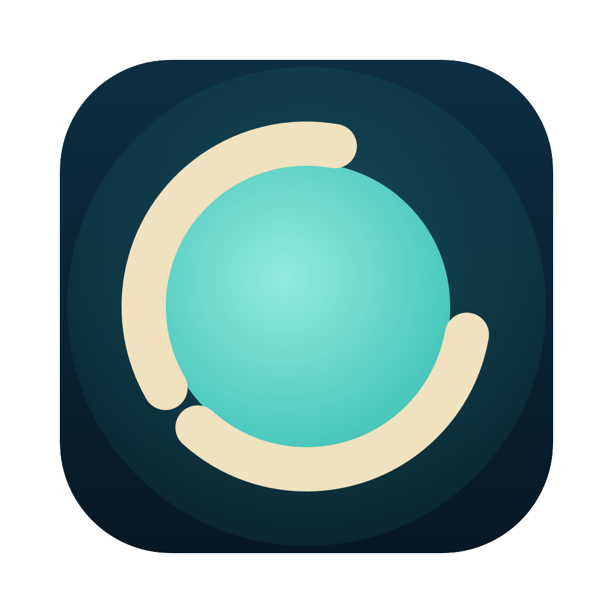

# Atoll

Dynamic-island-style notch app for macOS: hover the notch (or hit the hotkey)
and it expands into a tabbed workspace that's always with you — Claude Code
FleetView, a scratchpad, a shell, or any terminal command you configure.

- Collapsed: black pill under the notch.
- Hover or hotkey (default ⌃⌥ Space): expands into the selected tab.
- Tabs: each is a terminal running a command of your choice (processes keep
  running while collapsed or on another tab), or a native notes scratchpad.
- Right-click: auto-focus toggle, launch directory for new sessions,
  hotkey preset, edit tabs, quit.

> Formerly **Claude Island** (a single embedded `claude agents` terminal).
> Atoll = a ring of many islands.

## Tabs

Tabs live in `~/.config/atoll/tabs.json` (created with defaults on first
launch; right-click → "Edit Tabs…" opens it; edits are picked up on the next
expand). Each entry is a terminal command, or `"type": "notes"` for the
scratchpad (autosaved to `~/.config/atoll/notes.md`):

```json
[
  { "name": "Fleet", "command": "~/.local/bin/claude agents" },
  { "name": "Notes", "type": "notes" }
]
```

Add your own with the "+" button: one click on a suggested tool found on
your PATH (herdr, lazygit, btop, …) or a Shell/Notes pane, or type a name
and any command. Right-click a tab to remove it. An entry without `command` opens a
plain login shell (`{ "name": "Shell" }`). Commands run via `zsh -lc` in the
configured launch directory, so anything on your PATH works — e.g.
`{ "name": "herdr", "command": "herdr" }`.

## Install

```sh
curl -fsSL https://raw.githubusercontent.com/pjoachims/claude-island/main/install.sh | sh
```

Downloads the latest [release](https://github.com/pjoachims/claude-island/releases)
into `/Applications` and launches it (replacing an old Claude Island.app if
present; prefs carry over).

If you download the zip in a browser instead, macOS will block the app ("Apple
could not verify...") because it's ad-hoc signed, not notarized. Either use the
installer above (curl downloads skip quarantine), or after the blocked launch go
to System Settings → Privacy & Security → "Open Anyway".

### Build from source

Requires Xcode 15+ / Swift 5.9 (macOS 14+).

```sh
./build.sh          # -> Atoll.app (also syncs /Applications copy)
open "Atoll.app"
```

Launch at login: System Settings → General → Login Items → add Atoll.app.

## Uninstall

Quit the app, delete Atoll.app, `rm -rf ~/.config/atoll`. If you installed a
pre-0.3 Claude Island: remove the `claude-island` hook entries from
`~/.claude/settings.json` and `rm -rf ~/.claude/island`.
